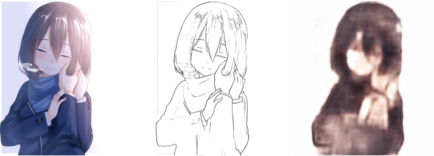
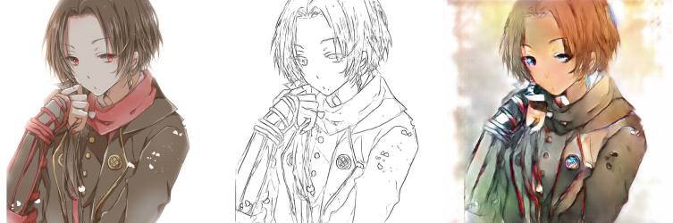
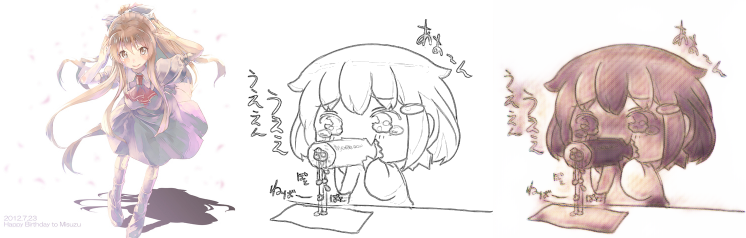

# SketchColorization

Trying to do AI based sketch line art colorization. Mostly focused on style transfer.

For info on all the runs and logs: [W&B project link](https://wandb.ai/bijin/sketch_colorization?workspace=user-bijin)

## AE

Tried using a simple autoencoder as a baseline. Did not work out well. Images are blurry and might as well be grayscale.

## V1

Based off of [this paper](https://arxiv.org/pdf/1706.03319v2.pdf). 
Used a UNet Generator, DCGAN-like Discriminator and VGG19 for style extraction.

Has trouble keeping within the outlines and taking all the information from the style hint.

## V2

Extremely experimental (mostly throwing things at a wall and seeing what sticks). Similar architecture to v1 but taking style hint from the last few MaxPool layers of VGG19 rather than fc1.

Also changed the way we get color style, instead of using the color image of the sketch as the style, I used some other color image in the batch.

Blurry, with seemingly nothing being done with the style information.

